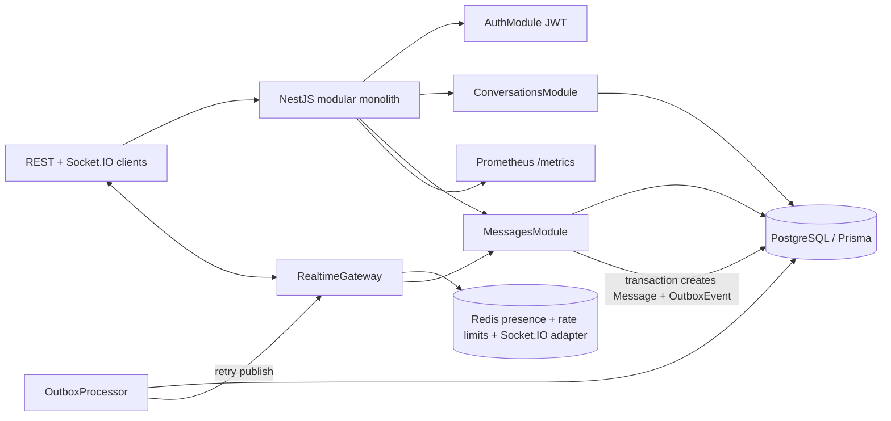

# Scalable Realtime Messaging System with NestJS, Socket.IO, PostgreSQL, Prisma, Redis, and OpenTelemetry

A production-style modular monolith that demonstrates advanced backend engineering for realtime messaging: authenticated WebSockets, horizontally scaled Socket.IO fan-out, transactional PostgreSQL writes, Redis presence, idempotent message sends, delivery/read receipts, an outbox event processor, observability, and load testing.

## CV Highlights

- Built a horizontally scalable realtime messaging backend using NestJS, Socket.IO, Redis adapter, PostgreSQL, and Prisma.
- Implemented reliable delivery mechanics with transactional writes, idempotency keys, delivery/read receipts, edit history, soft delete, and an outbox event processor.
- Designed Redis-backed multi-device user presence with TTL heartbeat and socket-to-user mappings.
- Added JWT authentication for REST and WebSocket handshakes with membership enforcement on conversation operations.
- Added OpenTelemetry tracing hooks, structured request logs, correlation IDs, and Prometheus-compatible `/metrics`.
- Added Docker Compose for app/PostgreSQL/Redis/Prometheus plus k6 load-test scenarios for WebSocket-heavy workflows.
- Added CI that installs dependencies, generates Prisma Client, lints, tests, and builds.

## Architecture



## System Design

The project is intentionally a modular monolith. Modules expose clear seams that could later become services without adding premature microservice complexity:

- `AuthModule`: register, login, JWT issuance, REST guard, WebSocket token verification.
- `UsersModule`: current-user profile and user search.
- `ConversationsModule`: direct/group conversation creation, membership management, membership authorization.
- `MessagesModule`: transactional message send, idempotency, cursor pagination, edit history, soft deletes, delivery/read receipts.
- `RealtimeModule`: Socket.IO gateway, Redis adapter, WebSocket event handlers, outbox publisher/processor.
- `PresenceModule`: Redis TTL-based online state and multi-device socket mapping.
- `RateLimitModule`: Redis-backed counters for websocket actions.
- `SearchModule`: authenticated message search scoped to memberships.
- `ObservabilityModule`: metrics, request correlation, structured logs, OpenTelemetry bootstrap.
- `PrismaModule` and `RedisModule`: data infrastructure boundaries.

## Database Schema

Prisma models include:

- `User` and `Session` for identity and optional refresh-token extension.
- `Conversation` and `ConversationMember` for `DIRECT` and `GROUP` conversations.
- `Message` with `MessageStatus`, `MessageType`, soft delete, edit timestamp, idempotency key, and cursor-friendly indexes.
- `MessageDelivery` and `MessageReadReceipt` for delivery/read state.
- `MessageEditHistory` for auditable edits.
- `UserBlock` and `AuditLog` as production-ready extension points.
- `OutboxEvent` for reliable publish-after-commit semantics.

Important constraints and indexes:

- `@@unique([senderId, idempotencyKey])` prevents duplicate message creation for retried sends.
- `@@index([conversationId, createdAt, id])` supports cursor pagination.
- `Conversation.directKey @unique` gives one direct conversation per user pair.
- Receipt and delivery tables enforce unique per-user/per-message state.

## Realtime Event Flow

1. Client connects with `handshake.auth.token` or `Authorization: Bearer <jwt>`.
2. Gateway validates JWT and attaches user data to `socket.data.user`.
3. Socket joins `user:{userId}` and all active `conversation:{conversationId}` rooms.
4. Redis stores socket mappings and presence TTL.
5. `message:send` is rate-limited, membership-checked, and persisted in PostgreSQL inside a transaction.
6. Transaction creates both `Message` and `OutboxEvent`.
7. Gateway emits `message:new`; the outbox processor retries if publish fails.

### Client Events

- `message:send`
- `message:ack`
- `message:edit`
- `message:delete`
- `typing:start`
- `typing:stop`
- `conversation:join`
- `conversation:read`
- `presence:heartbeat`

### Server Events

- `message:new`
- `message:delivered`
- `message:read`
- `message:updated`
- `message:deleted`
- `typing:update`
- `presence:update`
- `conversation:created`
- `conversation:member-added`
- `error`

## Outbox Pattern

The critical write path uses a database transaction to create the message and an `OutboxEvent` in the same commit. Realtime publish is therefore not the source of truth. If process/network failure occurs after commit but before Socket.IO fan-out, `OutboxProcessor` polls pending/failed events and retries publishing to the appropriate conversation room.

This demonstrates a common production pattern for reliable integration events without introducing a separate broker.

## Redis Scaling

Socket.IO rooms are in-memory by default. With two NestJS instances, a socket connected to instance A would not receive an event emitted by instance B unless an adapter forwards broadcasts. This project uses `@socket.io/redis-adapter` so each instance publishes room broadcasts through Redis.

Redis also stores:

- `presence:{userId}` TTL keys for online state.
- `user:{userId}:sockets` sets for multi-device tracking.
- `socket:{socketId}:user` lookup keys.
- `rate:*` counters for websocket rate limits.

### Run Multiple Instances Locally

```bash
npm run build
PORT=3000 npm start
PORT=3001 npm start
```

Connect one client to `localhost:3000` and another to `localhost:3001`; when both join the same conversation room, messages emitted from either process are distributed via Redis.

## REST API Examples

```bash
curl -X POST http://localhost:3000/auth/register \
  -H 'Content-Type: application/json' \
  -d '{"email":"a@example.com","username":"alice","displayName":"Alice","password":"password123"}'

TOKEN=$(curl -s -X POST http://localhost:3000/auth/login \
  -H 'Content-Type: application/json' \
  -d '{"email":"a@example.com","password":"password123"}' | jq -r .accessToken)

curl -H "Authorization: Bearer $TOKEN" http://localhost:3000/auth/me
curl -H "Authorization: Bearer $TOKEN" 'http://localhost:3000/users/search?q=ali'
curl -X POST -H "Authorization: Bearer $TOKEN" -H 'Content-Type: application/json' \
  http://localhost:3000/conversations/group \
  -d '{"title":"Backend Study Group","memberIds":["USER_ID"]}'
```

Message endpoints:

- `GET /conversations/:conversationId/messages?cursor=&limit=`
- `POST /conversations/:conversationId/messages`
- `PATCH /messages/:id`
- `DELETE /messages/:id`
- `POST /conversations/:conversationId/read`
- `GET /search/messages?q=&conversationId=`

## WebSocket Example

```ts
import { io } from 'socket.io-client';

const socket = io('http://localhost:3000', { auth: { token: accessToken } });

socket.on('message:new', console.log);
socket.on('message:read', console.log);
socket.on('presence:update', console.log);

socket.emit('message:send', {
  conversationId,
  body: 'hello from a horizontally scalable gateway',
  idempotencyKey: crypto.randomUUID(),
});

socket.emit('conversation:read', { conversationId, messageId });
socket.emit('presence:heartbeat');
```

## Local Setup

```bash
cp .env.example .env
npm install
npx prisma generate
docker compose up -d postgres redis
npx prisma migrate dev --name init
npm run start:dev
```

## Docker Setup

```bash
npm run build
docker compose up --build
```

Prometheus is available at <http://localhost:9090> and scrapes app metrics from `/metrics`.

## Testing and Quality

```bash
npm run lint
npm test
npm run test:e2e
npm run build
```

The unit tests cover authentication sanitization, membership authorization, idempotent message send, transactional outbox creation, read receipt transactions, WebSocket authentication, WebSocket message send, and outbox retry publishing.

## Load Testing

The `load-test/k6-realtime.js` scenario registers/logs in virtual users, opens WebSocket connections, sends heartbeat/typing activity, and checks login success.

```bash
BASE_URL=http://localhost:3000 k6 run load-test/k6-realtime.js
```

Observe:

- HTTP request duration and failure rate.
- WebSocket session duration.
- Redis CPU/memory and key churn.
- PostgreSQL write latency on `Message`, `MessageDelivery`, `MessageReadReceipt`, and `OutboxEvent`.
- `/metrics` process and default Node.js metrics.

Expected output includes k6 counters for HTTP checks, websocket sessions, and iteration throughput. Bottlenecks are usually PostgreSQL transaction latency, Redis fan-out bandwidth, and per-event JSON serialization.

## Observability

- Correlation ID interceptor accepts or generates `x-request-id` and returns it on responses.
- Logging interceptor emits structured JSON with request ID, method, path, user ID, and duration.
- `/metrics` exposes Prometheus-compatible Node.js process metrics.
- `src/tracing.ts` starts OpenTelemetry auto-instrumentation and the code wraps important operations such as outbox retry with spans.

## Security Notes

- Passwords are hashed with argon2.
- DTO validation uses class-validator and a global `ValidationPipe`.
- JWT REST guard protects application APIs.
- WebSocket handshakes reject missing/invalid tokens.
- Membership checks prevent non-members from reading/sending conversation messages.
- Edit/delete is restricted to the original sender.
- REST login and websocket send/typing actions are rate-limited.
- Helmet and CORS are configured in `main.ts`.
- Password hashes are never returned from auth APIs.

## Tradeoffs and Known Limitations

- The project uses polling for the outbox processor; PostgreSQL `LISTEN/NOTIFY` or a broker could reduce latency.
- Search uses Prisma `contains` for portability; production PostgreSQL full-text search with generated `tsvector` columns would scale better.
- Refresh-token storage is modeled but not fully exposed as public endpoints.
- Admin moderation and role-based delete/edit policies are intentionally minimal.
- The k6 WebSocket example is a portable baseline; richer Socket.IO protocol-level load tests can be added with Artillery's Socket.IO engine.

## Future Improvements

- Add refresh token rotation and session revocation endpoints.
- Add attachment metadata and object storage integration.
- Add PostgreSQL full-text indexes and ranking.
- Add Grafana dashboards and OTLP collector compose service.
- Add partitioning/archiving for large message tables.
- Add property-based tests for idempotency and retry behavior.
